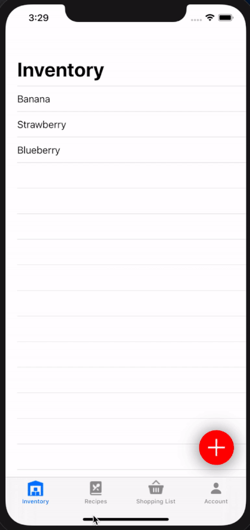

# Inventory-Manager
### Insight of this app
This project is currently in progress. This app is an inventory manager app which manages the ingredients and grocery's list and suggests you with possible dishes you can coock with your ingredients list. This app can add items to the list via following ways **image recognition**, **barcode scanning**, **grocery list scanning**, **typing text**.

This app uses frameworks like **CoreML**, **CoreAnimation**, **RxSwift**, **RxCocoa** etc... below is the current progress of the project. This project is expected to be developed and completed by the end of May 2020.

Demo 1 :

